# 🔍 AI Project — Maze Solver & Search Algorithm Comparison

This project demonstrates and compares classic **Artificial Intelligence search algorithms** by solving a maze problem.  
Each algorithm attempts to find a path from a **start point** to a **goal**, and the project compares their **performance, path length, and execution time**.

---

## 🧠 Project Overview

The goal of this project is to understand how different AI search algorithms behave when solving the same maze problem.

The project includes:

- Maze generation and representation
- Multiple search algorithms
- Performance comparison (time & path)
- Visualization using images

---

## 🧩 Implemented Algorithms

### 🔹 Uninformed Search
- Breadth-First Search (**BFS**)
- Depth-First Search (**DFS**)
- Iterative Deepening Search (**IDS**)
- Uniform Cost Search (**UCS**)

### 🔹 Informed (Heuristic) Search
- Greedy Best-First Search
- **A\*** Search

### 🔹 Optimization / Meta-Heuristic
- Hill Climbing
- Genetic Algorithm

---

## 📁 Project Structure

```text
AI-Project/
│
├── Images/                          # Visualization outputs
│   ├── RandomMaze.png               # Original maze layout
│   ├── BFSPath.png                  # BFS solution path
│   ├── DFSPath.png                  # DFS solution path
│   ├── AStarPath.png                # AStarPath solution path
│   ├── IDS.png                      # IDS solution path
│   ├── UCS.png                      # UCS solution path
│   ├── HillClimbingPath.png         # HillClimbingPath solution path
│   ├── GeneticPath.png              # GeneticPath solution path
│   ├── GreedyBFSPath.png            # GreedyBFSPath solution path
│   ├── compare_nodes.png            # Chart: Nodes Explored Comparison
│   ├── compare_path.png             # Chart: Path Length Comparison
│   ├── compare_time.png             # Chart: Execution Time Comparison
│
├── Maze.py                          # Maze representation & utilities
│
├── Main.py                          # Main entry point (runs all algorithms)
├── GenerateComparisonCharts.py      # Script to generate performance charts
│
├── BFS.py                           # Breadth-First Search algorithm
├── DFS.py                           # Depth-First Search algorithm
├── IDS.py                           # Iterative Deepening Search
├── UCS.py                           # Uniform Cost Search
├── GreedyBFS.py                     # Greedy Best-First Search
├── AStarSearch.py                   # A* Search implementation
├── HillClimbing.py                  # Hill Climbing algorithm
├── GeneticAlgorithm.py              # Genetic Algorithm approach
│
└── README.md                        # Project documentation
```

---

## 🖼 Visualizations

This section shows how each algorithm solves the same maze.  
All images are located inside the `Images/` folder.

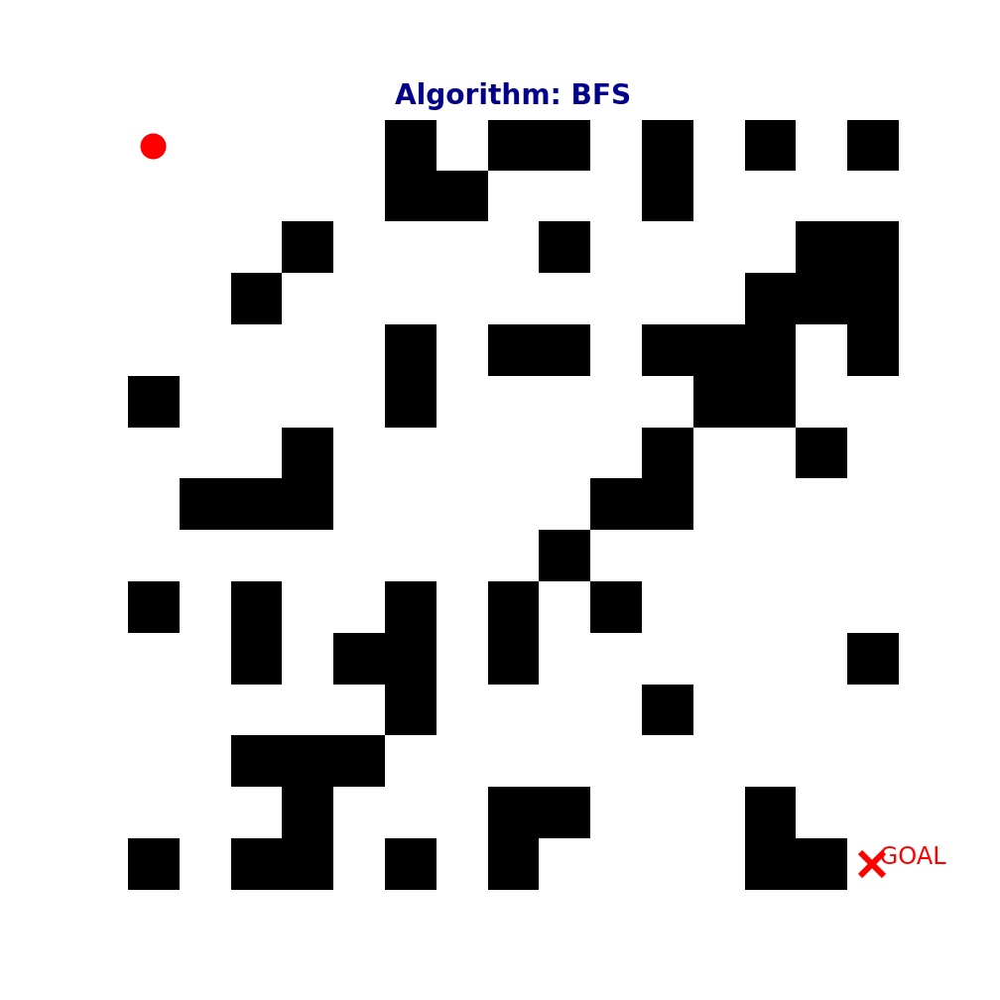

---

### 🧩 Original Maze

The randomly generated maze used by all algorithms:

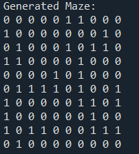

---

### 🛣 Solution Paths by Algorithm

#### 🔹 Breadth-First Search (BFS)
Explores level by level and guarantees the shortest path in unweighted mazes.

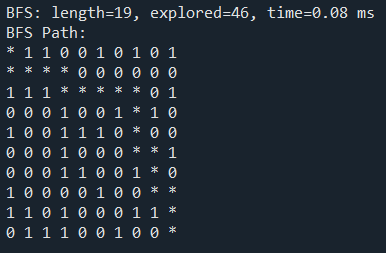

---

#### 🔹 Depth-First Search (DFS)
Explores deeply before backtracking; not guaranteed to find the shortest path.

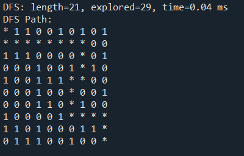

---

#### 🔹 Iterative Deepening Search (IDS)
Combines DFS memory efficiency with BFS completeness.

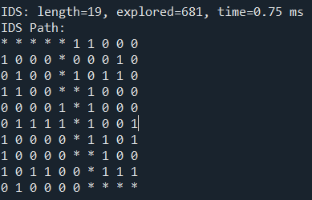

---

#### 🔹 Uniform Cost Search (UCS)
Finds the lowest-cost path by expanding the least-cost node first.

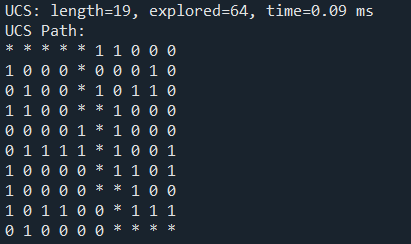

---

#### 🔹 Greedy Best-First Search
Uses only heuristic distance to guide the search toward the goal.

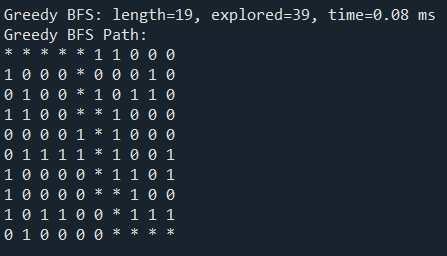

---

#### 🔹 A* Search
Combines path cost and heuristic for optimal and efficient results.

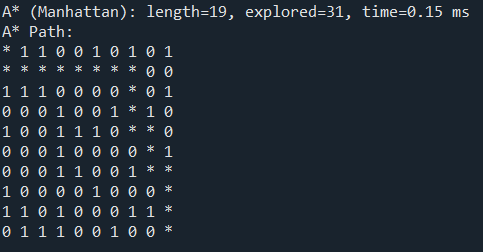

---

#### 🔹 Hill Climbing
A local search approach that may get stuck in local optima.

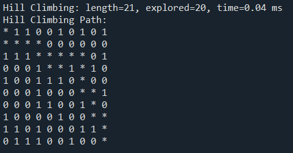

---

#### 🔹 Genetic Algorithm
Evolution-based approach using selection, crossover, and mutation.

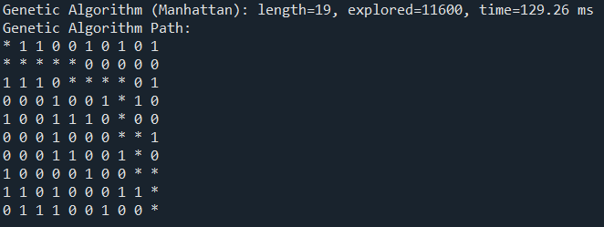

---

## 📌 Visualization Notes

- All algorithms use the **same maze** for fair comparison.
- Paths are drawn from **start (S)** to **goal (G)**.
- Different colors represent explored nodes and final paths.
- Image results may vary due to randomness in maze generation and genetic operations.

---

> 📊 These visualizations clearly show differences in **path length**, **search behavior**, and **efficiency** across algorithms.

---

# 📊 Algorithm Performance Analysis

This section analyzes the performance of 8 different search algorithms based on **Path Length** (Optimality), **Nodes Explored** (Efficiency), and **Execution Time** (Speed).

> **Note:** The data below was collected from a single run on a 10x10 maze.

## 📈 Summary Data

| Algorithm | Path Length | Nodes Explored | Time (ms) |
| :--- | :---: | :---: | :---: |
| **BFS** | 19 | 46 | 0.08 |
| **DFS** | 21 | 29 | 0.04 |
| **A* (Manhattan)** | 19 | 31 | 0.15 |
| **UCS** | 19 | 48 | 0.11 |
| **IDS** | 19 | 407 | 0.52 |
| **Hill Climbing** | 21 | 20 | 0.04 |
| **Genetic Algo** | 19 | 11,600 | 129.26 |
| **Greedy BFS** | 19 | 23 | 0.06 |

---

## 📸 Visual Comparisons

### 1. Execution Time (Log Scale)
* **Fastest:** DFS & Hill Climbing (0.04 ms) - *Note: Hill Climbing found a suboptimal path.*
* **Slowest:** Genetic Algorithm (129 ms) - *Due to evolving multiple generations.*

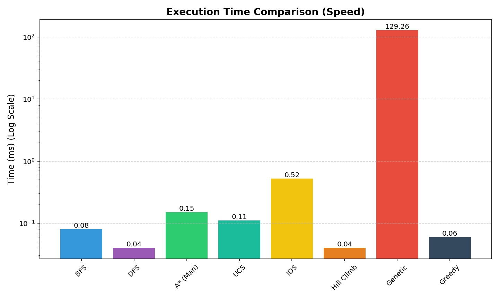

### 2. Search Efficiency (Nodes Explored)
* **Most Efficient:** Hill Climbing (20 nodes) & Greedy BFS (23 nodes).
* **Least Efficient:** Genetic Algorithm (11,600 evaluations) & IDS (407 nodes).

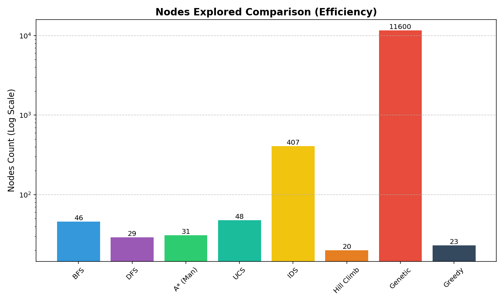

### 3. Path Optimality (Length)
* **Optimal (19 steps):** BFS, UCS, A*, IDS, Greedy, Genetic.
* **Sub-optimal (21 steps):** DFS, Hill Climbing.

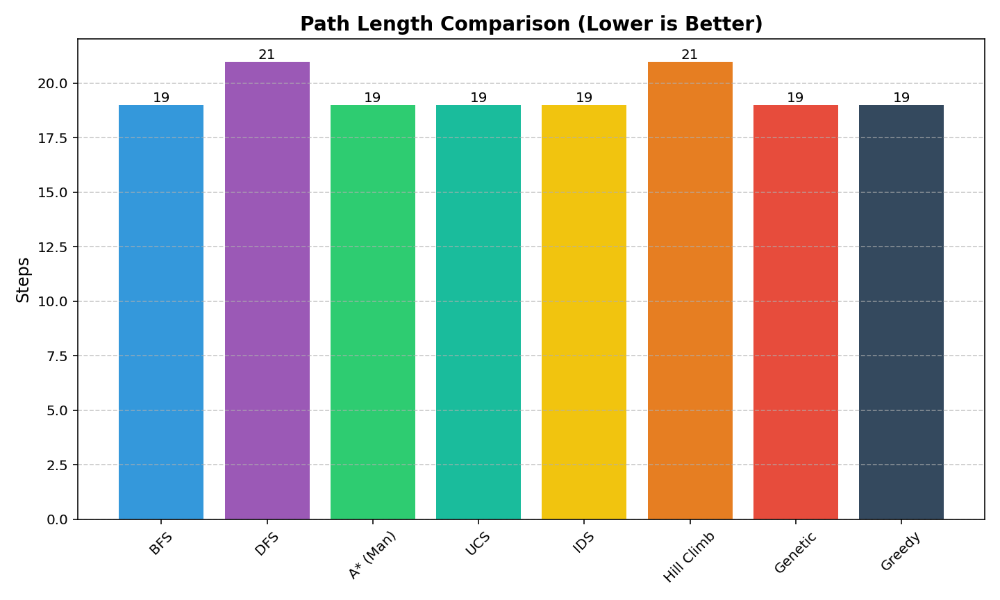

